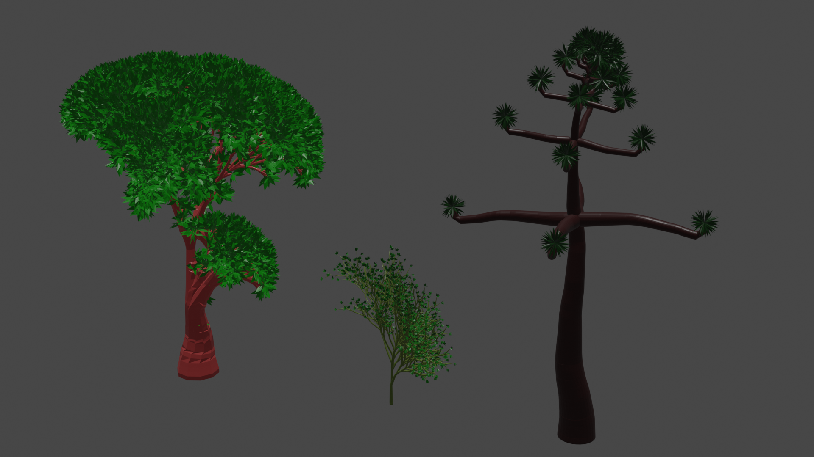
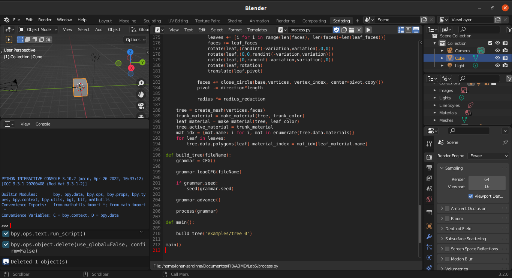

# L-System 3D trees
## Lab5 - A3MD @ UPC
## By: Iohan Sardinha


## How to run:
Open blender in the same folder as the scripts
**It's very important that it's opened in the same folder in order for the CFG and MeshCreator scripts to be imported properly!**
```bash 
$ cd location/of/scripts
$ blender
```

Open [process.py](process.py) in blender

Change the name of the tree file in the main function to a text file with the Tree CFG format that is described bellow
```python
build_tree(your_file_path)
```

### Tree CFG format:
The text format describing the tree is very strict, with mostly about the number of spaces between the instructions, yet simple. The number of spaces between the tokens in the instructions must be exactly the described no to yield errors.
All instructions begin with an instruction name, if it does not, it's interpreted as a comment and ignored.
The instructions are the following, the brackets represent oprional fields:

| Instruction | Description|
|---|---|
|`NODE ID [args]`|A token on the grammar vocabulary. Described in more detail bellow| 
|`RULE FROM [(chance)]:=TO1[\|TO2]`|A rule in the grammar. The tokens used must have ben defined before. Described in more detail bellow|
|`START TOKEN`|The start tokens of the grammar, with no space between them. Can be one or many. Must have ben defined before as a token|
|`SEED N`|The random function seed, in order to produce the same tree every time|
|`STEPS N`|The number of times the grammar will be processed|
|`LEAF_COLOR R G B A`|Defines the color of the leafs, in RGBA.|
|`TRUNK_COLOR R G B A`|Defines the color of the trunk, in RBBA|

##### NODE
There are some predefined Tokens that should be defined if they will be used in the grammar. And optionally custom tokens can be used. Each token can have a number of args, but no all args will have effects toghether with every token. Any word added as an arg will be accepted and won't produce an error, but will not have effect. All arguments are optional.


**Nodes**:
| Node | Description |
|--|--|
|**F**|Go forward|
|**X**|A leaf|
|**[**|Push the stack|
|**]**|Pop the stack|
|**+**|Rotatates to the positive direction in the Y axis|
|**-**|Rotatates to the negative direction in the Y axis|
|**W**|Rotatates to the positive direction in the X axis|
|**S**|Rotatates to the negative direction in the X axis|
|**R**|Rotatates to the positive direction in the Z axis|
|**L**|Rotatates to the negative direction in the Z axis|
|**Custom**|Can have any single character as id, and behave either as F or X|


**Arguments**:
|Argument|Description|Tokens affected|Default|
|--|--|--|--|
|length|The distance advanced in a step| F, X, + , -, W, S, R, L, custom marked as "forward"|1|
|radius| The radius of the trunk| F|0.5|
|angle| The angle of of rotation from the current direction| +, -, W, S, R, L|25|
|width| The width of the leaf | X, custom marked as "leaf" |0.5|
|height| The height of the leaf | X, custom marked as "leaf"|0.5|
|variation| The angle of random variation when growing a branch or between the leaves| All|0|
|var_perc| The thurshold [0,1] of the chance of a variation occuring| All |0.2|
|density| The amount of leaves on a leaf node| X, custom marked as leaf|10|
|resolution| The number of sides of each section of the trunk or leaves| F, X, custom marked as "leaf"|8|
|reduction| The amout in percentage [0,1] the trunk will shrink in radius every step| F|0|
|leaf| Defines a custom token as a leaf, if set to 1| custom|-|
|forward| Defines a custom token as a trunk, if set to 1| custom|-|

##### RULES
Rules can be defined in two ways. Deterministic or probabilistic.
- Deterministic rules are defined by a single token followed by `:=` and one or many tokens. Everything without spaces.
    ```
    F:=FF
    ```
- Probablilistic rules are defined as a single token, followed by a space, a number between 0 and 1 between parenthesis. Then without spaces `:=` the first following token sequence and the second, separated by `|`.
    The number is the chance that the first sequence follows the token.
    ```
    F (0.5):=F|FF
    ```

Custom nodes can me used to with combination with probabilistic rules, in order to make rules that have more than two following sequences. In sacrifice of the number of steps to get to the desired tree. 

#### Example
```
NODE F length:0.25 reduction:0.005 radius:4 variation:5 var_perc:0.1 resolution:30
NODE X
NODE [
NODE ]
NODE + angle:90
NODE - angle:90   
NODE W angle:90
NODE S angle:90
NODE A forward:1 length:0.13 variation:4 var_perc:0.1
NODE B forward:1 length:0.18 variation:5 var_perc:0.1
NODE T leaf:1 density:100 variation:180 length:2 width:0.2 resolution:4

RULE F (0.9):=FF|F
RULE X:=[+B-T][-B+T][WBST][SBWT]AX
RULE B:=BB
RULE A:=AA

START FX
SEED 1
STEPS 8
LEAF_COLOR 0 0.05 0 1
TRUNK_COLOR 0.05 0.01 0.01 1
```
Other examples can be found in [examples](examples/) folder

### Building a grammar directly

If you wish to use the scripts directly instead of creating your CFG Tree file, here's and example that should be pasted in the `main` function of [process.py](process.py):

```python
# Equivalent to examples/tree 0

# Create the tokens
F  = Node("F",{"resolution":10, "reduction":0.05, "radius":5, "variation":10})
X  = Node("X", {"resolution":4, "density":10})
LB = Node("[")
RB = Node("]")
P  = Node("+",{"variation":10, "var_perc":0.5})
M  = Node("-",{"variation":10, "var_perc":0.5})
W  = Node("W",{"variation":10, "var_perc":0.5})
S  = Node("S",{"variation":10, "var_perc":0.5})

# Create the grammar
grammar = CFG([X],[F,X,LB,RB,P,M,W,S])

# Create the rules
F_rule = Rule(F,[F,F],[F,LB,M,X,RB,F],0.8)
X_rule = Rule(X,[F,LB,M,X,RB,LB,P,X,RB,LB,W,X,RB,S,X])
# Alternatively could be:
F_rule = grammar.readRule("F (0.8):=FF|F[-X]F")
X_rule = grammar.readRule("X:=F[-X][+X][WX]SX")

# Adding the rules
grammar.addRule(F_rule)
grammar.addRule(X_rule)

grammar.seed = 1 #optional
seed(grammar.seed)
# If grammar.seed is not set
seed(1)

grammar.steps = 6 #optional
grammar.leaf_color = (0,0.4,0,0.5)
gramar.trunk_color = (0.8,0.1,0.1,1)

grammar.advance()
# If grammar.steps is not set:
# grammar.advance(6)

process(grammar)
```

### Notes on how it works
The scripts are divided into two APIs
#### CFG
Has all the classes and methods to create and process CFGs
##### Node class
Tokens in the vocabulary of the grammar
```python
F = Node("F",{length:2})
```

##### Rule class
Rules for words
```python
#F 0.6 -> FF
#F 0.4 -> F
r1 = Rule(F,[FF],[F],0.6)
```
**Methods**
- **next()**: computes the token after a processing step, depending on the probability

##### CFG class

**Methods**
The main grammar class, that stores the rules and process the tokens
```python
grammar = CFG(start=[X], vocabulary=[X,F,LB,RB,P,M])
grammar.addRule(grammar.readRule("F:=FF"))
grammar.addRule(grammar.readRule("X:=[+X]-X"))
grammar.advance(5)
print(grammar.state())
```
- **addRule(rule)**: Adds a rule, from the rule class, to the grammar
- **translate(word)**: Translate a string with token ids into a list of Node objects from the vocabulary
- **advance(n=None)**: Process the state of the grammar n times, if n is not defined the attribute `steps` of the CFG class can be set
- **state()**: Returns a readable string representing the current state of the grammar
- **readRule(line)**: Returns a `Rule` object from a string in the rule format
- **loadRules(fileName)**: Loads the rules in a file, one in each line, into the grammar
- **loadCFG(fileName)**: Fills all the attributes of a grammar following the above discribed file format of CFG Tree

#### MeshCreator
Has the functions to create the tree mesh and object
- **make_circle(radius=1, center=Vector((0,0,0)), subdivisions=30)**: Returns the vertices of a circle in projected in XY, with given radius and "subdivision" faces
- **make_leaf(dx=1,dy=1, subdivisions=10)**: Returns the vertices of a leaf with "dx" width, "dy" height and "subdivisions" faces
- **add_circle(c,v,vi)**: Adds the `c` list of local vertices to the `v` list of global vertices of a mesh and the `vi` dict with the vertex id to index relation
- **connect_circles(c1,c2,vi)**: Returns the faces that connect the circles `c1` and `c2` creating a cylinder. Needs `vi` the dict with the vertex id to index relation
- **close_circle(c, v, vi, center=None, offset=Vector((0,0,0)))**: Returns the faces that close the circle `c` with in the center. `Offset` is the offset from the `center` of the circle where the central vertex will be. Needs `v` the global vertices list of the mesh and `vi` the dict with the vertex id to index relation
- **rotate(p, r)**: Rotates the the `p` vertices `r` degrees, where r is a touple of X,Y,Z angles in this order 
- **translate(p, t)**: Translates the `p` vertices in `t` where `t`= (X,Y,Z)
- **make_material(mesh, color)**: Creates and adds to `mesh` a material with `color` color
- **create_mesh(vertices,faces)**: Creates a mesh given it's vertices and faces
